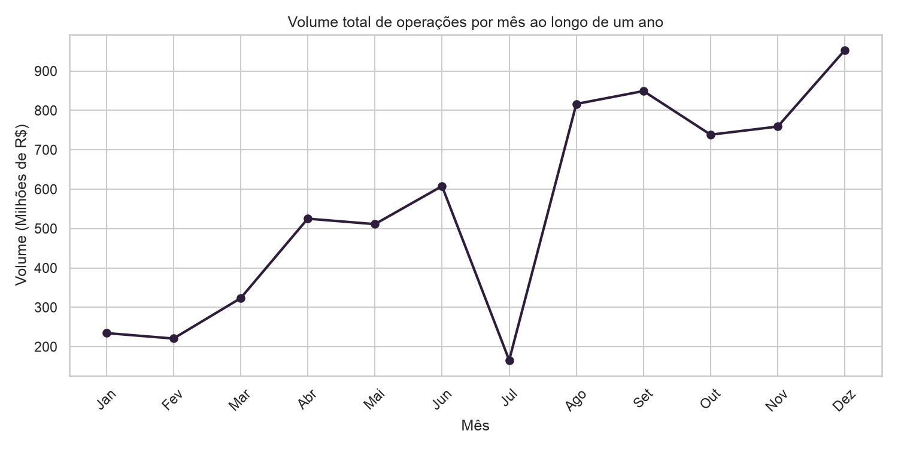
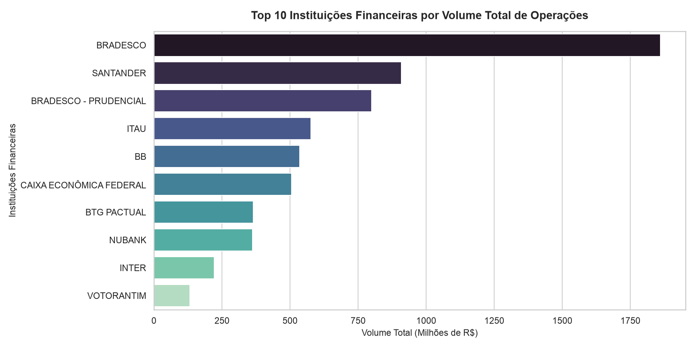
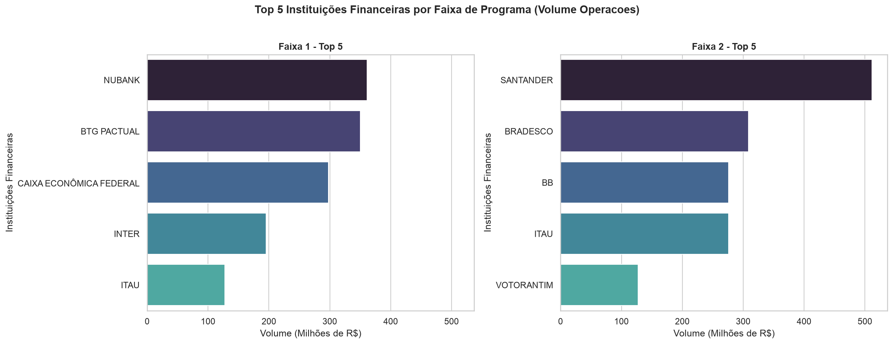
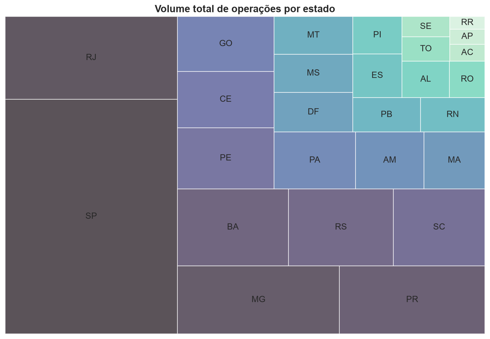

# DataView: Exploração e Análise de Dados do programa Desenrola Brasil

Projeto de análise exploratória dos dados do programa Desenrola Brasil desenvolvido em Python através de um Jupyter notebook. O notebook lê, limpa, transforma,
analisa e visualiza um dataset, proporcionando métricas e informações. Este projeto é parte da avaliação do curso Desenvolvimento de IA para Análise Preditiva do programa SCTEC.

## Os dados: Desenrola Brasil

Foi escolhido um conjunto de dados real do programa Desenrola Brasil, um programa de renegociação de dívidas de pessoas físicas inadimplentes. O dataset é [disponibilizado pelo Banco Central do Brasil](https://dadosabertos.bcb.gov.br/dataset/desenrola-brasil) e contém informações sobre as operações de renegociação, incluindo o número de operações, o volume financeiro renegociado e a distribuição por tipo de operação, instituição financeira e unidade federativa.

## Tecnologias utilizadas (e suas versões)

- Python 3.14.3
- Jupyter Notebook 7.5.7
- Pandas 3.0.3
- Numpy 2.4.6
- Matplotlib 3.11.0
- Seaborn 0.13.2
- Squarify 0.4.4 (para plotagem do mapa de árvore)

- Durante o desenvolvimento deste projeto foi utilizado um ambiente virtual (venv) para gerenciar as dependências do projeto, garantindo que as bibliotecas necessárias estejam isoladas.

- Utilizei a biblioteca Logging para registrar o processo de extração dos dados e tratamento de outliers.

## Relatório de desenvolvimento

#### Idioma
Todas as funções e variáveis do projeto, nomes de branches e commits no Github estão nomeadas em inglês, enquanto os comentários, relatórios no notebook e este README estão em português para facilitar a compreensão da equipe que avaliará o projeto — assim como o dataset em si que é elaborado pelo Banco Central do Brasil.

### Extração dos dados

- Como o dataset foi criado pelo governo brasileiro (através do Banco Central), que tipicamente usa o separador ; e vírgula para decimais, foi necessário usar o parâmetro `sep=';'` e `decimal=','` ao ler o arquivo CSV com o Pandas.

- O dataset é bastante limpo. Portanto, para fins de demonstração de técnicas de limpeza de dados, foi criado um processo de "sujar" o dataset, introduzindo valores nulos, strings com espaços, datas inválidas e valores extremos.

### Limpeza dos dados

- Foi feita a limpeza de valores textuais, removendo espaços vazios antes ou depois do texto, bem como unificando em apenas um espaço caso houvesse mais de um;
- Foi feita a transformação da coluna de data, convertendo os valores para objetos datetime e removendo registros com datas inválidas (530 registros);
- Foi criada uma função auxiliar para preencher os valores nulos na coluna de nome do conglomerado financeiro, tomando como base o código do conglomerado, já que cada código corresponde a uma instituição específica. (Imputação baseada em mapeamento);
- Só existem 2 faixas no programa Desenrola Brasil (1 e 2) e uma outra categoria colocada como tipo 3, então valores fora disso são inválidos. Foram removidos, portanto, os registros em que o valor na coluna "tipo" não correspondia a uma dessas 3 opções (56 registros).
- Foi removida a coluna de código do conglomerado financeiro, já que a coluna de nome do conglomerado financeiro é mais legível e já contém a mesma informação.
- Foram removidos os registros com valores nulos restantes (46) e duplicados (428).

Ao final da limpeza o dataset passou de 11658 registros para 10598 (o número original antes de ter sido sujo), ou seja, foram removidos 1060 registros durante o processo de limpeza.

### Tratamento de outliers

Ao se testar utilizar o método IQR para identificar os outliers, foram encontrados e removidos 2399 registros. Esse número representa um percentual significativo do dataset, indicando que o método do IQR na escala original não é adequado para tratar os outliers presentes nesse dataset. Para corroborar essa interpretação, foram plotados no notebook gráficos que confirmam que a distribuição dos dados é altamente assimétrica e contém muitos valores extremos — algo comum em dados financeiros — o que faz com que o método do IQR identifique uma quantidade excessiva de outliers.

Segundo nosso log:
'NUMERO_OPERACOES': Encontrados 1848 outliers (limite_inferior=-107.50, limite_superior=184.50)
'VOLUME_OPERACOES': Encontrados 1685 outliers (limite_inferior=-382135.32, limite_superior=639915.60)
v1=10598 | v2=8199 | removidas=2399

Apliquei portanto uma escala logarítmica ao método IQR para tentar reduzir a influência dos valores extremos e obter uma detecção de outliers mais adequada para esse dataset.

Para que a função siga sendo flexível, foi adicionado um parâmetro `logarithmic` que, quando definido como `True`, aplica a transformação logarítmica aos dados antes de calcular os limites do IQR. Isso permite que a função seja utilizada tanto para dados com distribuição normal quanto para dados com distribuição altamente assimétrica e valores extremos.

Segundo nosso log:
'NUMERO_OPERACOES': Encontrados 29 outliers (limite_inferior=-0.98, limite_superior=9689.63)
'VOLUME_OPERACOES': Encontrados 0 outliers (limite_inferior=-0.67, limite_superior=872928944.90)
v1=10598 | v2=10569 | removidas=29

Optei por realizar a remoção de outliers utilizando a aplicação da escala logarítmica ao método IQR e produzindo o dataframe v2. A versão v2 será utilizada nas etapas seguintes de análise.

### Criar Colunas Derivadas com Transformações

Foram criadas colunas derivadas a partir do dataset limpo, entre elas colunas para datas (mês, trimestre e ano) e a "FAIXA_VOLUME" a partir do volume de dinheiro renegociado, com as categorias "Volume Baixo", "Volume Médio" e "Volume Alto" com base na divisão dos dados em terços. Também foram criadas as colunas "LOG_NUMERO_OPERACOES" e "LOG_VOLUME_OPERACOES" com a aplicação da escala logarítmica sobre as colunas numéricas, para facilitar a análise de dados financeiros.

### Calcular Métricas Agregadas

Foram calculadas métricas agregadas através de agrupamentos:
- Volume de operações por mês
- Número de operações por mês
- Volume de de operações por estado
- Volume de operações por instituição financeira
- Instituições financeiras campeãs em volume por faixa do programa

#### Informações relatadas a partir das métricas

- O mês com maior volume de renegociações foi setembro de 2023, com um volume total de mais de R$ 704 milhões. Este dado possivelmente não é fidedigno, pois de acordo com o Banco Central ao descrever o dataset: "apenas para a data-base de setembro de 2023, as informações contemplam operações renegociadas dentro do programa no mês de setembro ou em meses anteriores", ou seja, o volume de setembro de 2023 inclui renegociações de meses anteriores, o que pode ter inflado o valor. Num eventual treinamento de modelo de IA o mês de setembro poderia ser desconsiderado pelo risco de distorção.

- Por outro lado, o mês com o maior número de operações foi novembro de 2023, com um total de 346.340 renegociações.

- São Paulo, Rio de Janeiro e Minas Gerais lideram o programa em volume de dívidas renegociadas.

- E em se tratando de conglomerados financeiros o maior volume de operações ficou em primeiro lugar com o Bradesco, seguido de Santander e Bradesco Prudencial.

#### Instituições financeiras líderes em volume de dívidas renegociadas por faixa do programa (faixa 1 e faixa 2)

A coluna TIPO_DESENROLA corresponde principalmente às faixas do programa Desenrola Brasil. A Faixa 1 contempla dívidas de pessoas físicas tenham renda mensal igual ou inferior a 2 (dois) salários mínimos ou estejam inscritas no Cadastro Único para Programas Sociais do Governo Federal (CadÚnico). Já a Faixa 2 contempla dívidas de pessoas físicas que tenham renda mensal superior a 2 (dois) salários mínimos e inferior a R$ 20.000,00 (vinte mil reais), conforme a [Lei nº 14.690, de 2023](https://www.planalto.gov.br/ccivil_03/_ato2023-2026/2023/lei/l14690.htm). O Sistema de Informações de Créditos (SCR) registra ainda um TIPO 3, mas não fornece informações sobre o que corresponde a esse tipo.

Resultado: na faixa 1 (renda mais baixa), as instituições financeiras campeãs em renegociações foram na ordem: Nubank, BTG Pactual e Caixa Econômica Federal. Já na faixa 2 (renda mais alta), a instituições financeiras campeãs em renegociações foram Santander, depois Bradesco e em seguida Banco do Brasil.

### Segmentar Conglomerados Financeiros por Volume de Operações

As instituições financeiras foram segmentadas de acordo com o volume total de operações renegociadas nas categorias Ouro (acima de 100 milhões), Prata (acima de 1 milhão e abaixo de 100 milhões) e Bronze (abaixo de 1 milhão), resultando na seguinte distribuição:
- Bronze  51 conglomerados financeiros
- Prata   14 conglomerados financeiros
- Ouro    11 conglomerados financeiros

### Calcular Estatísticas com NumPy: Ticket Médio

Para exercitar o uso do NumPy foi criado um novo array dos tickets médios de renegociação, calculados a partir do volume de operações dividido pelo número de operações. A partir desse array foram calculadas as seguintes estatísticas:
- Média do Ticket Médio: 7576.24
- Desvio Padrão: 25805.85
- Mediana: 1166.73
- Percentil 25: 230.88
- Percentil 75: 3662.40

### Visualizar os dados com gráficos

As bibliotecas Matplotlib, Seaborn e Squarify foram utilizadas para gerar visualizações para algumas da métricas calculadas a partir deste dataset.

#### Gráfico de linha

Os dados que temos são de setembro de 2023 até abril de 2026, então os únicos anos completos foram 2024 e 2025. Ainda assim, o gráfico de linha sugere visualmente a tendência de que as renegociações crescem em direção ao fim do ano calendário.

#### Gráfico de barras

O gráfico aponta o Bradesco como lídeo absoluto em volume de operações renegociadas, com um volume maior que o dobro do segundo colocado, o Santander. O Bradesco Prudencial, que é uma instituição financeira do mesmo grupo do Bradesco, aparece em terceiro lugar, o que reforça a liderança do grupo Bradesco no programa Desenrola Brasil.

#### Gráfico de barras por faixas 1 e 2 do programa

Conforme vimos nas métricas anteriores, as instituições financeiras possuem focos bem definidos e diferentes em relação às faixas de renda das renegociações, não havendo sobreposição de conglomerados entre os primeiros 4 nomes do ranking de cada faixa.

Usando como referência as renegociações de endividamentos, Nubank, BTG Pactual e Caixa Econômica Federal parecem ter uma maior penetração entre clientes de renda mais baixa.

#### Mapa de árvore (Treemap)

O mapa de árvore mostra a distribuição do volume de operações renegociadas por estado. São Paulo é o estado com o maior volume disparado à frente do restante do Brasil, seguido por Rio de Janeiro e Minas Gerais. A visualização destaca certa concentração das renegociações, mas ela pode estar alinhada com a própria distribuição populacional no Brasil, que tem São Paulo, Minas Gerais e Rio de Janeiro como os estados mais populosos.
